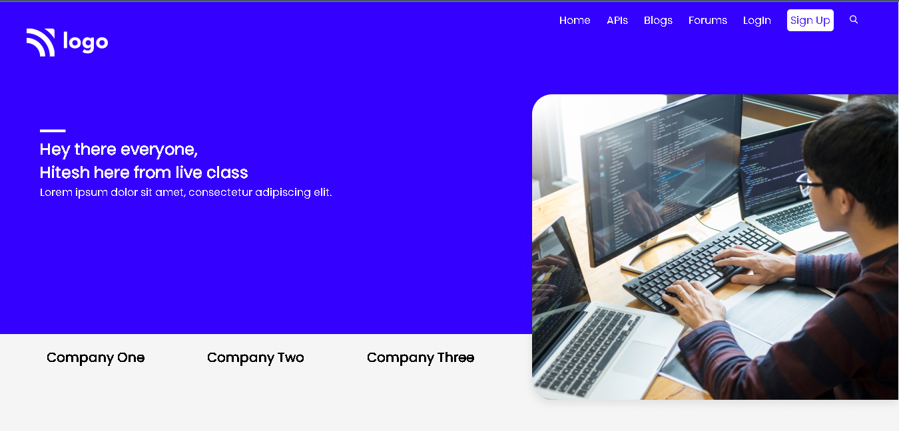

# Assignment-9

# Project [Deployed Link](https://deepakproject09.netlify.app)

- What I learned from this Project?
  - 
  - Learned how to make card's in website.
  - Learned about Layout making through Flexbox. 
  - Learned about Box Shadow.
  - Learned how to use Hover Effect.
  - how to make end to end website.
  - How to use different Google Fonts in webpage.
  - Learned how to make responsive web-design.
  
  

 
---

## Time taken to finish this project

- 5.5 hour to complete it.

---

## ScreenShot

